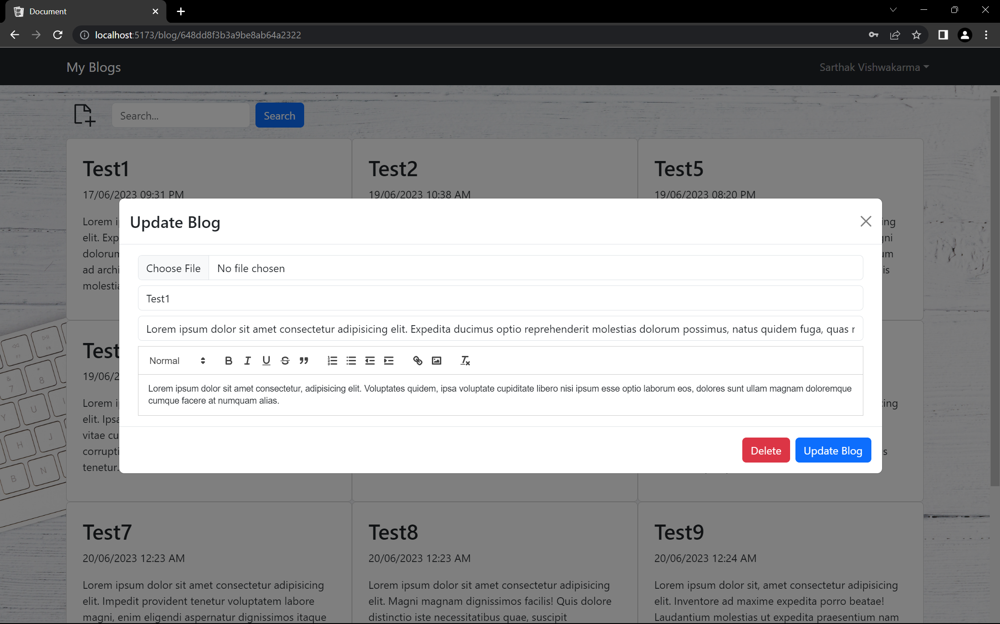
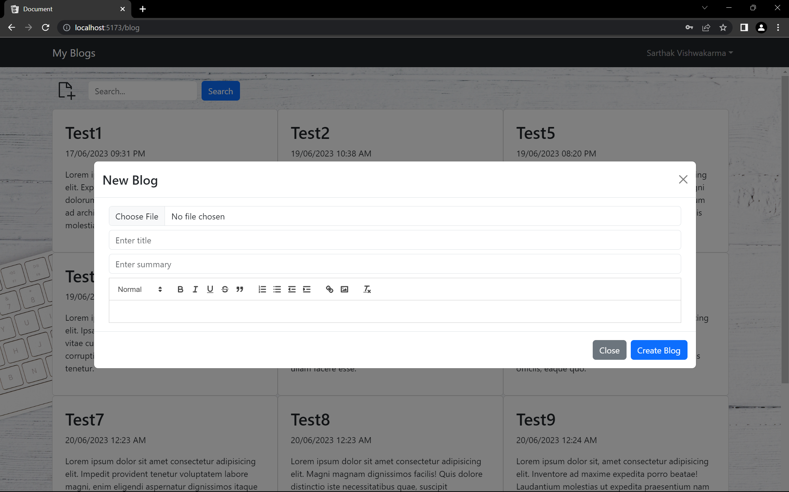

# Notes Vault

This is a MERN stack application with authentication and Redux Toolkit for state management. This is for a SPA (Single Page Application) workflow that uses the [Vite](https://vite.dev) Build tool

<details>
  <summary>Screenshots</summary>
  
  
  
  
  
  
</details>

It includes the following:

- Backend API with Express & MongoDB
- Routes for auth, logout, register, update profile, delete profile
- JWT authentication stored in HTTP-only cookie
- Protected routes and endpoints
- Multer middleware to handle file uploads
- Custom middleware to check JSON web token and store in cookie
- Custom error middleware
- React frontend to register, login, logout, view profile, and update profile
- React Bootstrap UI library
- React Toastify notifications

## Usage

- Create a MongoDB database and obtain your `MongoDB URI` - [MongoDB Atlas](https://www.mongodb.com/cloud/atlas/register)

### Env Variables

Rename the `.env.example` file to `.env` and add the following

```
NODE_ENV = development
PORT = 5000
MONGO_URI = your mongodb uri
JWT_SECRET = 'abc123'
```

Change the JWT_SECRET to what you want

### Install Dependencies (frontend & backend)

```
npm install
cd frontend
npm install
```

### Run

```
# Run backend (:5000)
npm run server

# Run frontend (:3000)
npm run dev
```

## Build & Deploy

```
# Create frontend prod build
cd frontend
npm run build
```
